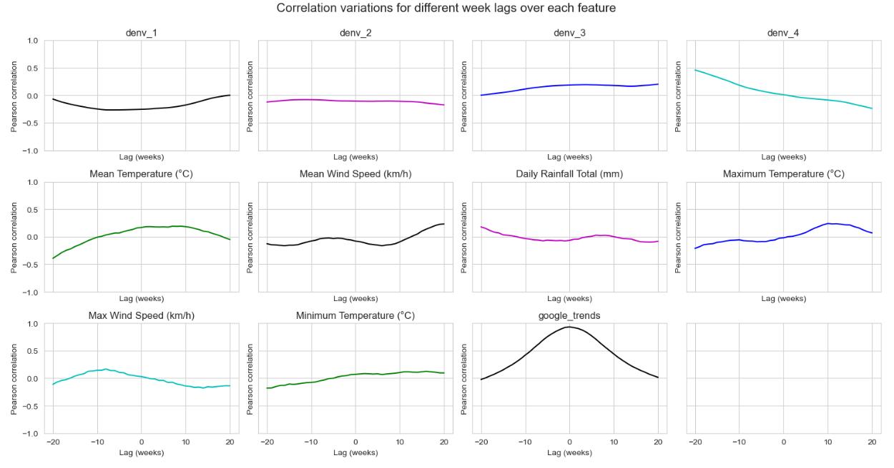

<!--
*** Writing this summary to condense the learning points from our exploratory data analysis!
-->

<!-- TABLE OF CONTENTS -->

  
Table of Contents

  <ol>
    <li><a href="#summary">Summary</a></li>
    <li><a href="#roadmap">Roadmap</a></li>
    <li><a href="#insights">Insights</a></li>
  </ol>

## Summary

1. Temperature and Rainfall  

> A regression line illustrates higher rainfall leads to lower mean temperature from 1980 to 2023.  

> We can observe a yearly seasonal pattern of temperature from 1980 to 2023  
> Slicing by years we can see temperature is highest in 2016 and 2019, and lowest in 2023 recently.  
> Slicing by months we can see temperature is highest in months of May-July across 1980 to 2023.  

> We can observe a yearly seasonal pattern of wind speed from 1980 to 2023, but the pattern is more noisy than temperature  
> Slicing by years we can see 2019 is the most windy year, and 2022 is least windy recently.  
> Slicing by months we can see april-may and october-november is least windy months across 1980 to 2023.  

> We can observe a yearly spikes in rainfall from 1980 to 2023, the pattern is also more noisy than temperature  
> Slicing by years we can see 2016 and 2019 is least rainy years, and 2023 is most rainy year recently.  
> Slicing by months we can see november-december are most rainy months across 1980 to 2023.  

> April to September are the hottest months, and 2016 and 2019 are the hottest years recently  

> Merged dataset from 2015 to 2020  

2. Dengue cases from 2018 to 2023
> Dengue cases spikes during the circuit breaker period, it might be influenced by many people staying indoors.

> Dengue cases is highest in May-July and is preceded by rainy months

> The temperature fits the optimum average temperature for mosquito growth and activity at 25–30 °C.
> The temperature is also optimal for replication of dengue virus in the mosquito. 
> Temperature do not determine how high the spikes will be every year

> Dengue cases matches the spikes and fluctuations in google trends. 
> Comparison of decomposition of trends and seasons side-by-side shows same spike in july each year.

> DENV_3 is the dominant strain from 2021 onwards, but the percentage is falling in 2023.
> DENV_2 percentage has dropped significantly since 2021 due to herd immunity.

>Google trends have the highest pearson correlation at time lag of 0 weeks  
>Mean temperature have consistent correlation at positive time lag of 0-10 weeks  
>Mean wind spead have some correlation at positive time lag of 20 weeks  
>Rainfall has some correlation at negative time lag of 20 weeks, and some   
>Maximum temperature have higher correlation at positive time lag of 10 weeks  

> Mean temperature have 0 to 10 weeks time lag, which is explained as yearly, the rise in temperature begins in April, which is around 2-3 months earlier than rise in dengue cases. The peak in temperature coincides with the peak in dengue cases.  
> However, the lag in rainfall is not consistent from the chart.

(<a href="#readme-top">back to top</a>)

## Roadmap

1. Data Pre-Processing
2. Exploratory Data Analysis
3. Train-Test Splitting
4. Model Training
5. Model Selection 
6. Cost Benefit Analysis
7. Recommendations

(<a href="#readme-top">back to top</a>)

## Insights

(<a href="#readme-top">back to top</a>)
